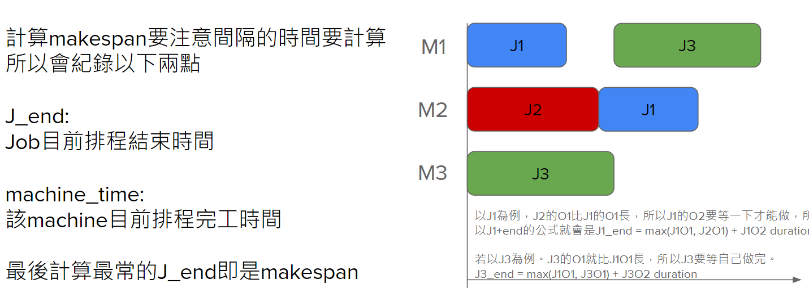

## Process
1. Check max_iteration_time
2. Generate Initial Population. Otherwise, last interaction’s 
3. selected poulation
4. Evaluate Fitness Score
5. Tournament Selection
6. Crossover & Mutation
    - Iterate all parent. Follow the probability to crossover a random parent
    - So does the mutation, and add their offspring to the population.
7. Sort the population(parent and offsprings) by “makespan”, and called survivors
8. Truncate the worst performance’s survivors until we left the request ammount of survivors
9. Get the best performance’s survivors and record it
Take the rest of the survivors to the next iteration

#### How to compute makespan
