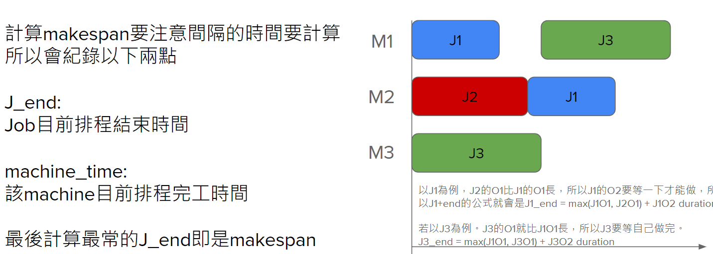

# Genetic Algorithm for Job Shop Scheduling

Open [GA_implementation.ipynb](GA_implementation.ipynb) after following the setup instructions in the [JSP overview](https://github.com/okumochu/Flexible-Job-Shop-Scheduling/blob/main/job-shop/README.md). Run it with this directory as the kernel working directory so that its `../Dataset/` paths resolve correctly.

## Implementation outline

1. Set the population size, iteration limit, and variation parameters.
2. Generate the initial population.
3. Evaluate each chromosome's makespan.
4. Select parents using the implemented tournament procedure.
5. Apply crossover and mutation.
6. Rank parent and offspring solutions and retain the configured survivors.
7. Record objective values and repeat until the iteration limit.

This outline describes the historical code. It does not establish the correctness or performance of the search strategy.

## Original makespan illustration

